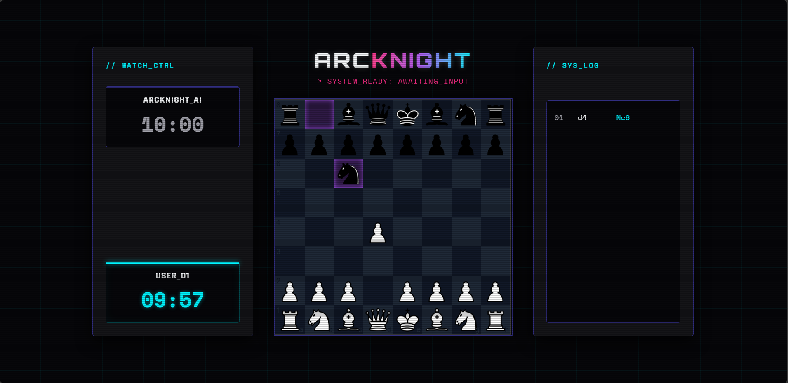

# ♟️ ArcKnight

> **A full-stack chess engine built from scratch in C++, featuring a custom search engine, a Node.js backend, and a Cyberpunk-inspired web interface.**



## 🚀 Overview

ArcKnight is a chess engine I built to understand how modern chess engines work under the hood while improving my skills in systems programming, algorithms, and full-stack development.

Instead of relying on existing engines like Stockfish, I implemented my own engine in **C++**, focusing on efficient move generation and game-tree search. The engine communicates with a **Node.js** backend that serves a responsive Cyberpunk-inspired web interface where users can play against the engine in real time.

The goal of this project was not just to build a playable chess game, but to explore the algorithms and optimizations that allow computers to evaluate millions of possible positions efficiently.

---

# ✨ Features

* ♟️ Custom chess engine written entirely in C++
* ⚡ Bitboard-based board representation for high-performance move generation (including full Castling, En Passant, and Promotions)
* 🧠 Negamax search with Alpha-Beta pruning
* 🔥 **MVV-LVA Move Ordering** (Most Valuable Victim - Least Valuable Attacker) for aggressive search tree pruning
* 🎯 Quiescence Search to reduce the Horizon Effect
* 🌐 Node.js backend communicating with the engine via the **UCI (Universal Chess Interface)** protocol using child processes
* 🎨 Custom Cyberpunk-inspired responsive interface
* ⏱️ Real-time chess clocks & untimed **Zen Mode** for deep analysis
* 📜 Live move-history terminal
* ✨ Animated move highlights and check notifications

---

# ⚡ Performance & Testing

ArcKnight is built with a focus on raw execution speed and memory efficiency. The engine relies on 64-bit integer bitboards and fast bitwise operations to generate and evaluate moves.

**Latest Benchmarks (Single-Threaded):**
* **Throughput:** ~3.8 Million Nodes Per Second (NPS)
* **Search Depth:** Stable at Depth 5 in timed matches (Reaches Depth 6 in Zen Mode)
* **Time Complexity Control:** MVV-LVA combined with Alpha-Beta pruning heavily optimizes the standard Minimax game tree, slashing node evaluations from millions to thousands.

**Testing Pipeline:**
The project utilizes **Google Test (gtest)** via CMake's `FetchContent` to mathematically validate low-level bitwise operations, move encoding/decoding, and search performance benchmarks to ensure data integrity during deep searches.

---

# 🏗️ Architecture

```text
Frontend (HTML/CSS/JavaScript)
            │
            ▼
      Node.js Backend
            │
     child_process API (UCI Protocol)
            │
            ▼
      C++ Chess Engine
```

The application is divided into three independent layers to enforce a strict separation of concerns, keeping the C++ backend focused purely on bare-metal performance while Node.js handles asynchronous web client networking.

---

# 🧠 C++ Chess Engine

The engine is responsible for move generation, board evaluation, and selecting the strongest move.

### Efficient Board Representation

The board is represented using **Bitboards (64-bit integers)**, allowing move generation to rely almost entirely on fast bitwise operations instead of arrays.

This approach dramatically improves both speed and memory efficiency.

### Search Algorithm

The engine searches positions using:

* Negamax
* Alpha-Beta Pruning
* MVV-LVA Move Ordering

By ordering moves to evaluate high-value captures first, Alpha-Beta pruning successfully eliminates massive branches of the game tree that cannot influence the final decision, allowing the engine to search significantly deeper than a naïve minimax implementation.

### Quiescence Search

To avoid tactical mistakes caused by the **Horizon Effect**, the engine extends its search through forcing capture sequences before evaluating a position.

This results in much more stable tactical play.

### Position Evaluation

The evaluation function scores positions using multiple heuristics, including:

* Material balance
* Piece-square tables
* Mobility
* King safety
* Pawn structure

---

# 🌐 Node.js Backend

The backend acts as a bridge between the browser and the C++ engine.

Its responsibilities include:

* Spawning the compiled C++ executable
* Maintaining Inter-Process Communication (IPC) through standard input/output
* Translating client actions into standard UCI text strings
* Returning the engine's best calculated move
* Exposing a lightweight REST API

This architecture keeps the engine completely independent from the frontend, making it theoretically capable of plugging into any standard chess GUI.

---

# 🎨 Frontend

The frontend was designed with a futuristic **Cyberpunk / Neon Tokyo** aesthetic.

Features include:

* Responsive design
* Animated move highlights
* Live chess clocks with Zen Mode toggle
* Terminal-inspired move history
* Check and checkmate alerts
* Smooth UI micro-interactions

The interface uses:

* HTML5
* CSS3
* JavaScript
* chess.js (move legality)
* chessboard.js (board rendering)

> **Note:** `chess.js` is used only for client-side move validation. All move evaluation, generation, and decision-making are performed exclusively by the custom C++ engine.

---

# 📁 Project Structure

```text
ArcKnight/
│
├── engine/                # C++ Engine Core
│   ├── inc/               # Header files (.h)
│   ├── src/               # Source files (.cpp)
│   └── CMakeLists.txt     # Engine build config
│
├── tests/                 # GoogleTest Suite
│   ├── gtest_main.cpp     # Unit tests & Benchmarks
│   ├── main_test.cpp      
│   └── CMakeLists.txt     # Test build config
│
├── index.html             # Frontend UI
├── server.js              # Node.js Backend
├── package.json           # Node dependencies
├── CMakeLists.txt         # Root build config
└── readme.md              # Documentation
```

---

# 🛠️ Tech Stack

| Layer     | Technologies            |
| --------- | ----------------------- |
| Engine    | C++20, CMake            |
| Testing   | Google Test (gtest)     |
| Backend   | Node.js, Express        |
| Frontend  | HTML5, CSS3, JavaScript |
| Libraries | chess.js, chessboard.js |

---

# 🚀 Future Improvements

Planned enhancements include:

* Transposition Tables using Zobrist Hashing
* Iterative Deepening Search
* Full UCI Time Management Integration
* Opening Book
* Endgame Tablebases
* Adjustable engine difficulty

---

# ⚙️ Running Locally

## 1. Build the engine and tests

```bash
mkdir build
cd build
cmake ..
cmake --build .
```

## 2. Run Engine Benchmarks (Optional)

```bash
.\tests\engine_tests.exe
```

## 3. Install backend dependencies

```bash
cd ..
npm install
```

## 4. Start the backend

```bash
node server.js
```

## 5. Play

Open `index.html` in your browser and start your first game as White.